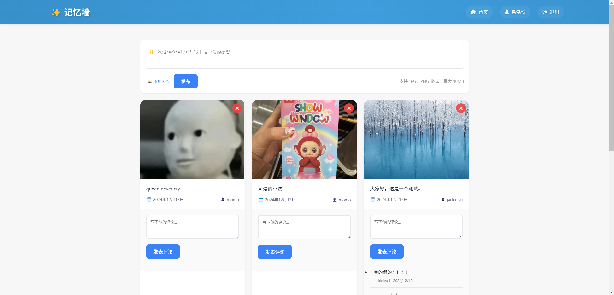
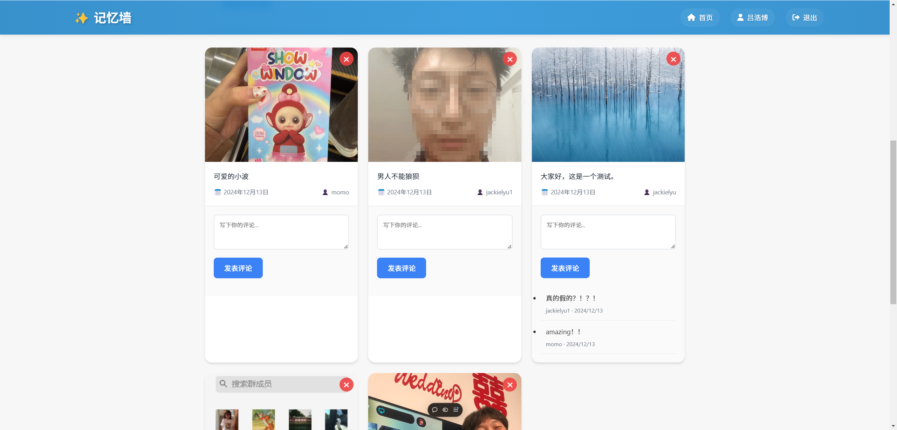
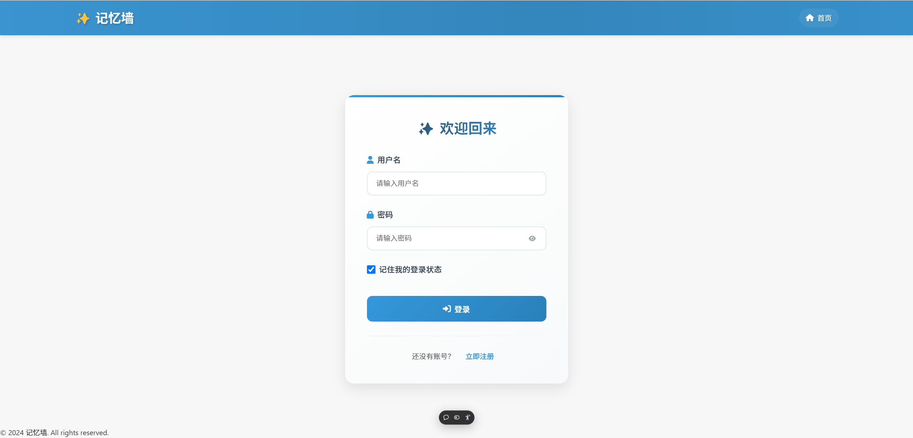

# 记忆墙 - 分享精彩时刻 🚀

[](https://github.com/yourusername/your-repo)
[](https://vercel.com)
[](LICENSE)

<div align="center">
  
  
  
  
   [[开始使用]](#🚀-快速开始) 
</div>

## 💡 项目简介

记忆墙是一个让用户分享和记录精彩时刻的社交平台。基于现代化的 Node.js 全栈技术开发，不仅是一个实用的社交应用，更是一个非常好的全栈开发学习案例。

### ✨ 核心特性

- 📱 优雅的响应式界面设计
- 🔐 完整的用户认证系统
- 📝 图文记忆发布与管理
- 💬 实时的社交互动功能
- 🚀 一键部署到 Vercel

## 🛠️ 技术方案

**后端技术**
- Node.js + Express.js 构建 RESTful API
- MongoDB 数持持久化
- JWT 处理身份认证
- Cloudinary 云端图片存储

**前端技术**
- EJS 服务端渲染
- 现代 CSS 布局
- Font Awesome 图标库

## 🚀 快速开始

### 本地开发

```bash
# 克隆项目
git clone git@github.com:may3rr/memoryWall.git

# 安装依赖
npm install

# 启动开发服务器
npm run dev
```

### 环境配置

复制 `.env.example` 到 `.env` 并配置以下环境变量：

```bash
PORT=3000
MONGODB_URI=your_mongodb_uri
JWT_SECRET=your_jwt_secret
```

> 注意：系统默认将用户名为"吕浩博"的账号设置为管理员权限。

### 部署上线

项目支持一键部署到 Vercel 平台：

1. Fork 本项目
2. 在 Vercel 导入项目
3. 配置环境变量
4. 完成部署

## 📚 项目结构

```
memoryWall/
├── app.js          # 应用入口
├── routes/         # 路由配置
├── models/         # 数据模型
├── middlewares/    # 中间件
├── public/         # 静态资源
└── views/          # 页面模板
```

## 🤝 参与贡献

1. Fork 本项目
2. 创建新特性分支
3. 提交代码
4. 发起 Pull Request

## 📄 开源协议

本项目采用 [MIT](LICENSE) 开源协议。

## 👨‍💻 关于作者

- 博客：[may3rr.github.io](https://may3rr.github.io)

---

如果这个项目对你有帮助，欢迎给个 Star ⭐️